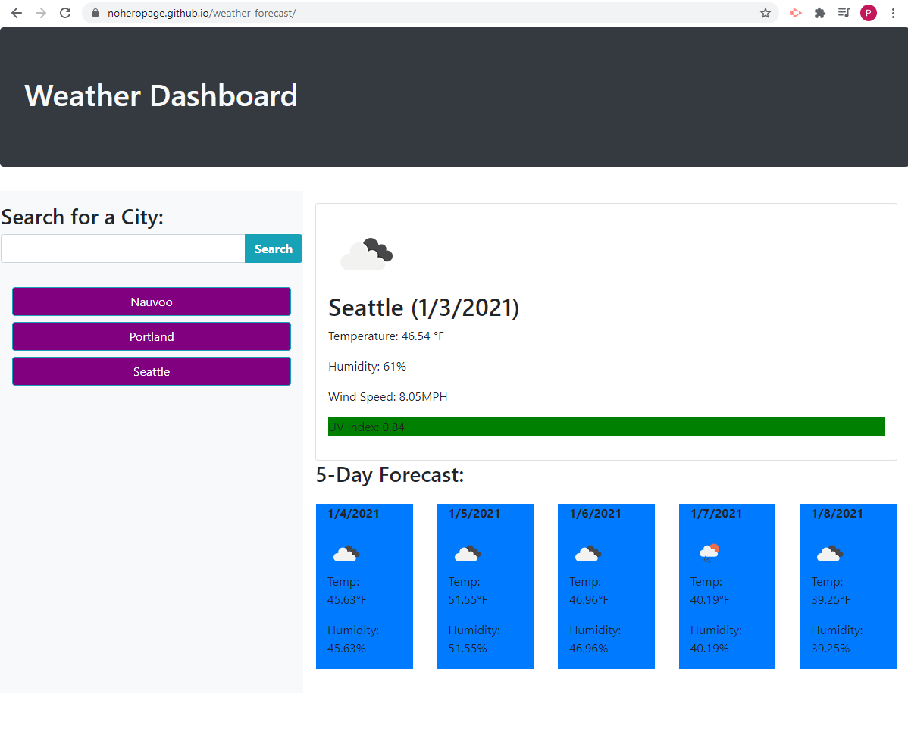

# Weather-Forecast
A website where a user can look-up cities by name and pull-up a corresponding weather forecast 

## Description
Website prompts user to search for a city. Once a city is entered and the search button is pressed several different APIs are called (through OpenWeather API) to display the current weather conditions (included color-coded UV Index for favorable, moderate, or severe) as well as weather conditions during the next five days. Relevant icons are included. Once a city is searched it is stored in the user's local storage and that data is used to populate a list of clickable buttons underneath the search bar. Clicking a button with do an API call again for the city selected. 

## Screenshot

## Link
[link to Weather Forecast website](https://noheropage.github.io/weather-forecast/) 